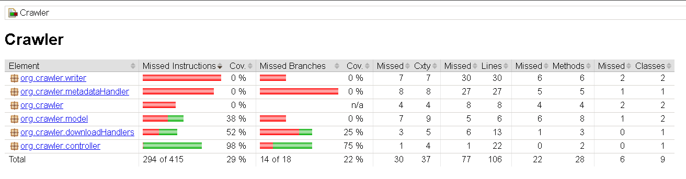

# Crawler - README

<div align="justify">

## Module Description
Crawler is a Java-based component designed to fetch, process, and upload book data. It is an essential part of the system for interacting with external sources, extracting metadata, and storing the results in a cloud service.

### Main Features:
1. **DownloadHandler:** Manages the download of book content.
2. **AWSWriter:** Handles the upload of processed data to AWS S3.
3. **BookController:** Coordinates the workflow of downloading, processing, and storing books.
4. **MetadataHandler:** Extracts metadata from book content, such as title, author, and publication date.
5. **GutenbergDownloadHandler:** Specialized downloader for handling Project Gutenberg content.

## Instructions for Running Tests

### Prerequisites
- Java Development Kit (JDK) 11 or later installed.
- Testing framework dependencies (e.g., JUnit, Mockito) added to your project.

### Running the Tests
The tests are executed using JUnit 5 and Mockito.

1. Compile the project:
   ```bash
   javac -d bin src/**/*.java
   ```
2. Run the tests:
   ```bash
   java -cp .:junit-platform-console-standalone-1.9.0.jar org.junit.platform.console.ConsoleLauncher --scan-classpath
   ```

### About the JaCoCo Framework
JaCoCo (Java Code Coverage) is a library for measuring and reporting code coverage in Java applications. It provides detailed metrics to identify untested parts of your code.

#### Key Metrics:
- **Instruction Coverage:** Measures the percentage of bytecode instructions executed during tests.
- **Branch Coverage:** Tracks which branches (e.g., if-else statements) were tested.
- **Line Coverage:** Shows the lines of source code executed.
- **Method and Class Coverage:** Identifies the tested methods and classes.

#### Generating Coverage Reports:
1. Run tests with JaCoCo agent attached to the JVM:
   ```bash
   java -javaagent:jacocoagent.jar -cp .:your_project_classes org.junit.platform.console.ConsoleLauncher --scan-classpath
   ```
2. Generate the coverage report:
   ```bash
   java -jar jacococli.jar report jacoco.exec --classfiles bin --sourcefiles src --html report
   ```
3. Open the `report/index.html` file to view the detailed coverage report.

### Example Metrics

| Element                          | Missed Instructions | Coverage | Missed Branches | Coverage | Missed Lines | Coverage | Missed Methods | Missed Classes |
|----------------------------------|---------------------|----------|-----------------|----------|--------------|----------|----------------|----------------|
| org.crawler.writer               | 30                  | 0%       | 7               | 0%       | 30           | 0%       | 6              | 2              |
| org.crawler.metadataHandler      | 27                  | 0%       | 8               | 0%       | 27           | 0%       | 5              | 1              |
| org.crawler                      | 8                   | N/A      | 4               | N/A      | 8            | N/A      | 4              | 2              |
| org.crawler.model                | 6                   | 38%      | 9               | 25%      | 6            | 38%      | 6              | 1              |
| org.crawler.downloadHandlers     | 13                  | 52%      | 3               | 25%      | 13           | 52%      | 3              | 1              |
| org.crawler.controller           | 22                  | 98%      | 1               | 75%      | 22           | 98%      | 0              | 0              |
| **Total**                        | 294 of 415          | 29%      | 14 of 18        | 22%      | 106          | 22%      | 22             | 6              |

### Test Objectives
The tests aim to:
1. **Ensure functional correctness:** Verify that implemented classes and methods behave as expected.
2. **Enhance robustness:** Validate proper handling of successful and erroneous scenarios.
3. **Support maintainability:** Facilitate future modifications through clear and concise tests.

### Test Details

#### Tested Classes

1. **DownloadHandler:** Verifies proper handling of book downloads, including successful and failed cases.
2. **AWSWriter:** Tests data uploads to AWS S3 and error handling.
3. **BookController:** Ensures end-to-end coordination of downloading, processing, and uploading.
4. **MetadataHandler:** Validates metadata extraction and error handling.
5. **GutenbergDownloadHandler:** Checks Project Gutenberg-specific filters and downloading capabilities.

### Execution Summary
- **Total Tests Executed:** 8
- **Successes:** 8
- **Failures:** 0

### Coverage Results
The coverage results, as measured by JaCoCo, are illustrated below:



These metrics provide insight into areas that require additional tests to improve overall coverage.

